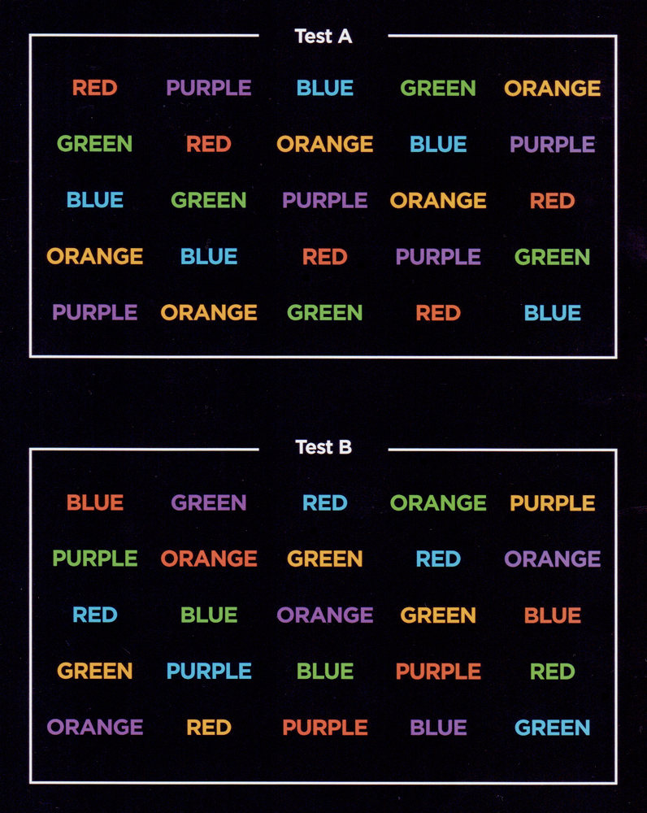

- Stroop task

# Idea
Negative priming Stroop trials induce a stronger Stroop interference effect. Whether a trial is negatively primed trial depends on the preceding trial. 

Example negative priming trial sequences (the second word is the negative priming trial):
-  BLUE   RED 
-  BLUE   RED 
-  BLUE   RED 

In the examples above, the trial preceding the negative priming trial (i.e., second word) primes participants to respond RED, which is the the wrong response (word-reading response) for the second word.

From Hanslmayr 2008 electrophysiological dynamics of Stroop interference

# References
