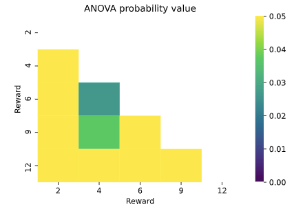
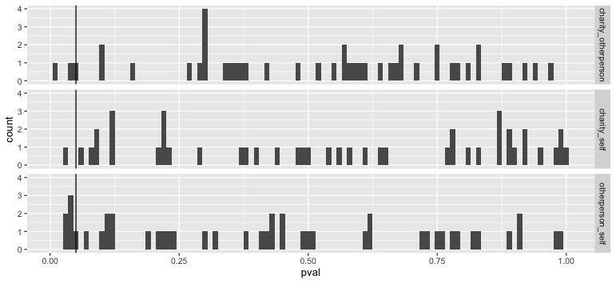

```
summary: can't decode reward!
created: 2020-09-21 20-06-51
modified: 2020-09-21 20-06-51
tags: 
```

- project - prosocial effort
- 20200921_202546 decoding reward matrices different svm alpha parameters

Model

```py
Xcols = ["effortS", "rtS", "choiceEffortS", "accUpdatingS", "rtUpdatingS"]
ycol = "reward"

def fit_classifier(X, y, loss="hinge", penalty="l2", cv=5, alpha=0.3):
    model = SGDClassifier(loss=loss, penalty=penalty, alpha=alpha)
    return cross_val_score(model, X, y, cv=cv).mean()
```

- accuracy = 0.4790

```py
array([[[    nan,  0.4765,  0.4834,  0.4722,  0.4983],
        [ 0.4765,     nan,  0.4646,  0.4706,  0.4852],
        [ 0.4834,  0.4646,     nan,  0.461 ,  0.4776],
        [ 0.4722,  0.4706,  0.461 ,     nan,  0.4554],
        [ 0.4983,  0.4852,  0.4776,  0.4554,     nan]],

       [[    nan,  0.4852,  0.4809,  0.4873,  0.4937],
        [ 0.4852,     nan,  0.5042,  0.48  ,  0.4801],
        [ 0.4809,  0.5042,     nan,  0.4659,  0.48  ],
        [ 0.4873,  0.48  ,  0.4659,     nan,  0.4611],
        [ 0.4937,  0.4801,  0.48  ,  0.4611,     nan]],

       [[    nan,  0.4624,  0.4815,  0.4851,  0.4932],
        [ 0.4624,     nan,  0.4562,  0.4353,  0.4813],
        [ 0.4815,  0.4562,     nan,  0.45  ,  0.4532],
        [ 0.4851,  0.4353,  0.45  ,     nan,  0.4504],
        [ 0.4932,  0.4813,  0.4532,  0.4504,     nan]]])
```




p-values from repeated meaures ANOVA

```py
array([[    nan,     nan,     nan,     nan,     nan],
       [ 0.9297,     nan,     nan,     nan,     nan],
       [ 0.8099,  0.0267,     nan,     nan,     nan],
       [ 0.1192,  0.0372,  0.5908,     nan,     nan],
       [ 0.8703,  0.3174,  0.0877,  0.3631,     nan]])
```

Mantel distance Fisher's z


Mantel distance p values


Overall decoding accuracies don't differ by group (ANOVA), but higher for other person relative to self.

```r
> m2 <- lmer(score ~ group + (1 | participant), data = dt_scores[include == 1])
> summaryh(anova(m2))
    term                            results
1: group F(2, 1303) = 2.54, p = .079, r = 0
> summaryh(m2)
               term                                                   results
1:      (Intercept)   b = 0.47, SE = 0.008, t(79) = 59.03, p < .001, r = 0.99
2:     groupcharity b = 0.004, SE = 0.007, t(1303) = 0.53, p = .597, r = 0.01
3: groupotherperson  b = 0.02, SE = 0.007, t(1303) = 2.16, p = .031, r = 0.06
```

Decoding accuracy per tile

```r
> dt_scores[
+     include == 1,
+     summaryh(anova(lmer(score ~ group + (1 | participant)))),
+     by = .(condpair)
+ ]
    condpair  term                          results
 1:      2 4 group F(2, 88) = 0.07, p = .930, r = 0
 2:      2 6 group F(2, 88) = 0.21, p = .810, r = 0
 3:      2 9 group F(2, 88) = 2.18, p = .119, r = 0
 4:     2 12 group F(2, 88) = 0.14, p = .870, r = 0
 5:      4 6 group F(2, 88) = 3.78, p = .027, r = 0
 6:      4 9 group F(2, 88) = 3.42, p = .037, r = 0
 7:     4 12 group F(2, 88) = 1.16, p = .317, r = 0
 8:      6 9 group F(2, 88) = 0.53, p = .591, r = 0
 9:     6 12 group F(2, 88) = 2.50, p = .088, r = 0
10:     9 12 group F(2, 88) = 1.02, p = .363, r = 0
> dt_scores[
+     include == 1,
+     summaryh(lmer(score ~ group + (1 | participant))),
+     by = .(condpair)
+ ]
    condpair             term                                                    results
 1:      2 4      (Intercept)    b = 0.47, SE = 0.02, t(128) = 29.13, p < .001, r = 0.93
 2:      2 4     groupcharity   b = −0.007, SE = 0.02, t(88) = −0.32, p = .750, r = 0.03
 3:      2 4 groupotherperson    b = 4e−04, SE = 0.02, t(88) = 0.02, p = .983, r = 0.002
 4:      2 6      (Intercept)    b = 0.49, SE = 0.02, t(129) = 30.48, p < .001, r = 0.94
 5:      2 6     groupcharity     b = 0.008, SE = 0.02, t(88) = 0.38, p = .703, r = 0.04
 6:      2 6 groupotherperson   b = −0.006, SE = 0.02, t(88) = −0.26, p = .792, r = 0.03
 7:      2 9      (Intercept)    b = 0.52, SE = 0.02, t(116) = 27.45, p < .001, r = 0.93
 8:      2 9     groupcharity    b = −0.05, SE = 0.02, t(88) = −2.08, p = .040, r = 0.22
 9:      2 9 groupotherperson    b = −0.02, SE = 0.02, t(88) = −0.95, p = .347, r = 0.10
10:     2 12      (Intercept)    b = 0.51, SE = 0.02, t(112) = 25.90, p < .001, r = 0.93
11:     2 12     groupcharity   b = −0.007, SE = 0.02, t(88) = −0.31, p = .761, r = 0.03
12:     2 12 groupotherperson     b = 0.005, SE = 0.02, t(88) = 0.22, p = .826, r = 0.02
13:      4 6      (Intercept)    b = 0.46, SE = 0.02, t(132) = 28.26, p < .001, r = 0.93
14:      4 6     groupcharity      b = 0.01, SE = 0.02, t(88) = 0.65, p = .519, r = 0.07
15:      4 6 groupotherperson      b = 0.06, SE = 0.02, t(88) = 2.64, p = .010, r = 0.27
16:      4 9      (Intercept)    b = 0.44, SE = 0.02, t(127) = 28.44, p < .001, r = 0.93
17:      4 9     groupcharity      b = 0.05, SE = 0.02, t(88) = 2.23, p = .028, r = 0.23 #
18:      4 9 groupotherperson      b = 0.05, SE = 0.02, t(88) = 2.29, p = .024, r = 0.24 #
19:     4 12      (Intercept)    b = 0.48, SE = 0.02, t(121) = 28.01, p < .001, r = 0.93 
20:     4 12     groupcharity      b = 0.03, SE = 0.02, t(88) = 1.32, p = .191, r = 0.14
21:     4 12 groupotherperson b = −7e−05, SE = 0.02, t(88) = −0.003, p = .997, r = 4e−04
22:      6 9      (Intercept)    b = 0.45, SE = 0.02, t(131) = 29.50, p < .001, r = 0.93
23:      6 9     groupcharity     b = 0.005, SE = 0.02, t(88) = 0.24, p = .811, r = 0.03
24:      6 9 groupotherperson      b = 0.02, SE = 0.02, t(88) = 0.99, p = .327, r = 0.10
25:     6 12      (Intercept)    b = 0.45, SE = 0.02, t(124) = 28.14, p < .001, r = 0.93
26:     6 12     groupcharity      b = 0.02, SE = 0.02, t(88) = 1.18, p = .240, r = 0.13
27:     6 12 groupotherperson      b = 0.05, SE = 0.02, t(88) = 2.24, p = .028, r = 0.23 #
28:     9 12      (Intercept)    b = 0.46, SE = 0.02, t(132) = 29.58, p < .001, r = 0.93
29:     9 12     groupcharity    b = −0.03, SE = 0.02, t(88) = −1.23, p = .224, r = 0.13
30:     9 12 groupotherperson    b = 6e−04, SE = 0.02, t(88) = 0.03, p = .978, r = 0.003
    condpair             term                                                    results
> 
```