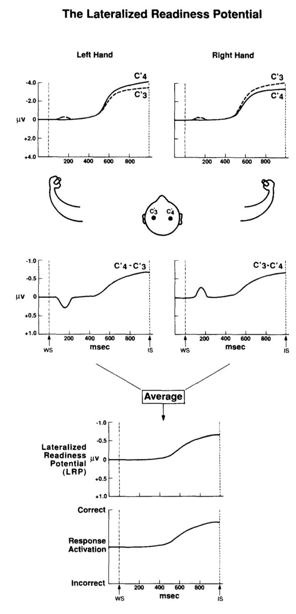
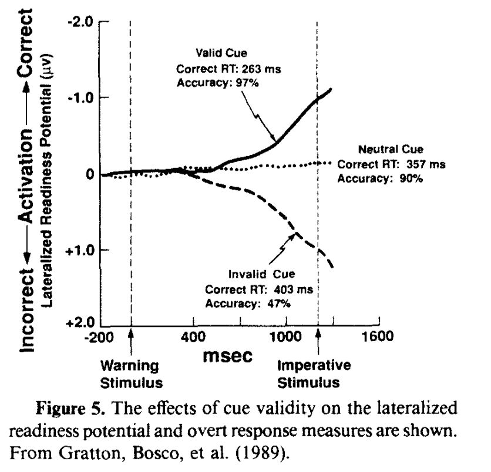
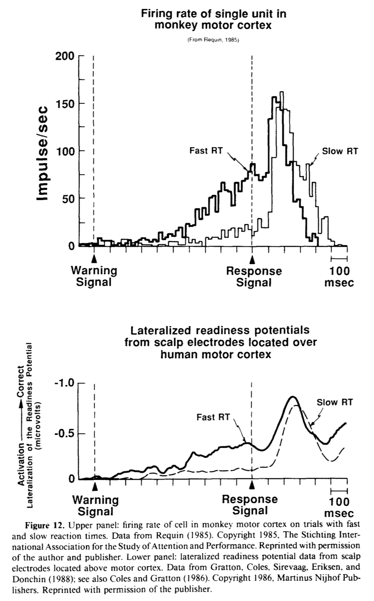
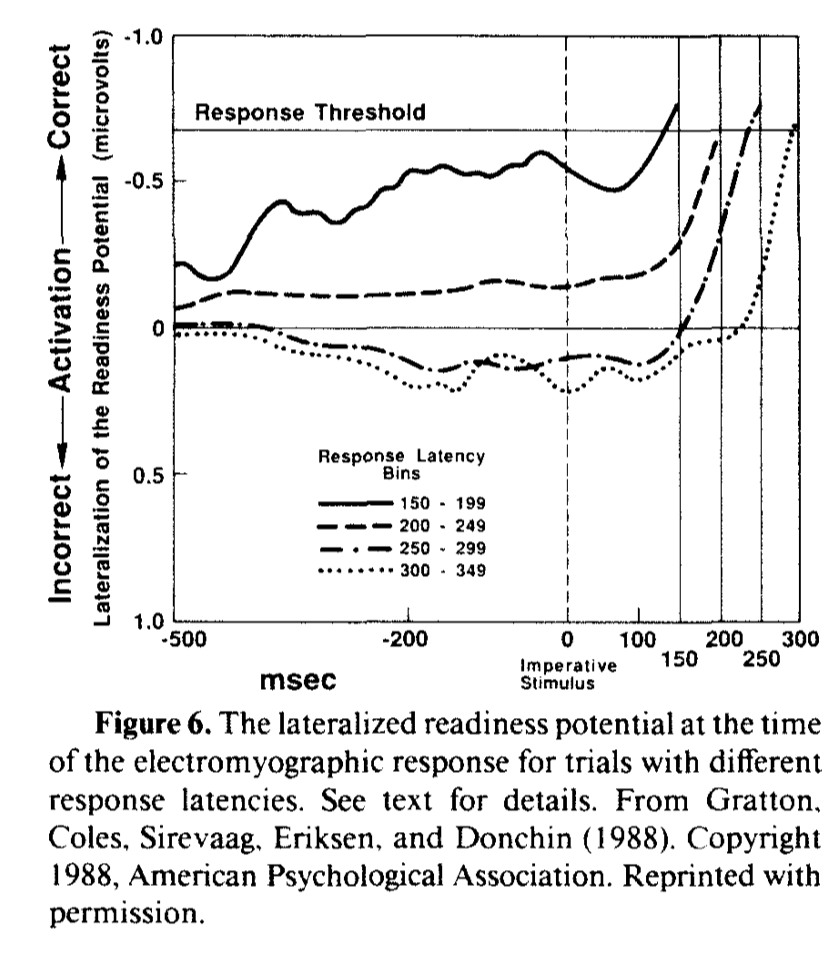
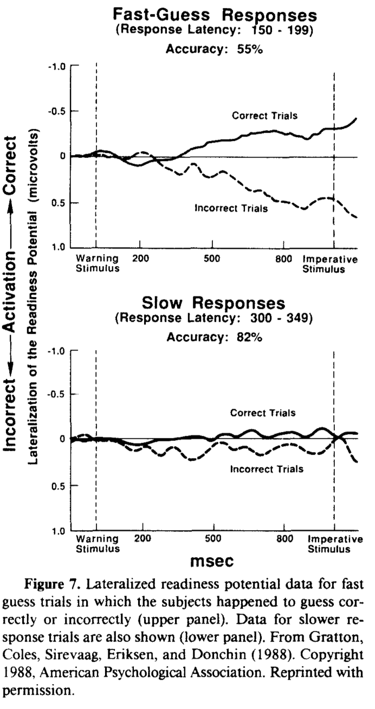
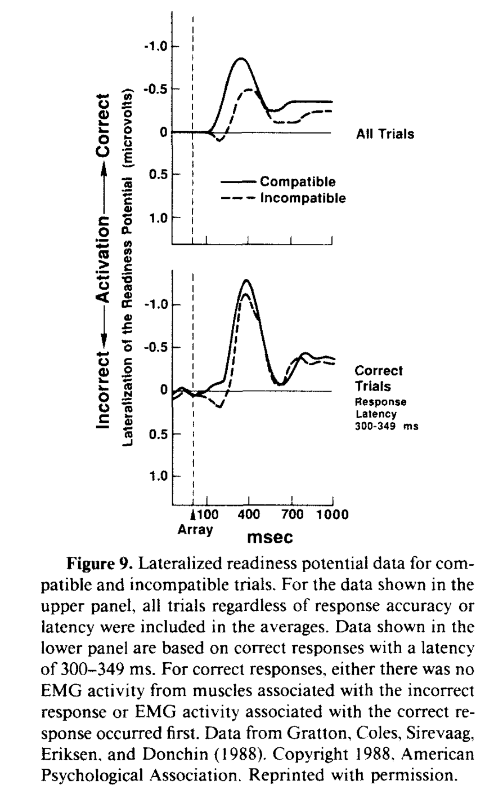
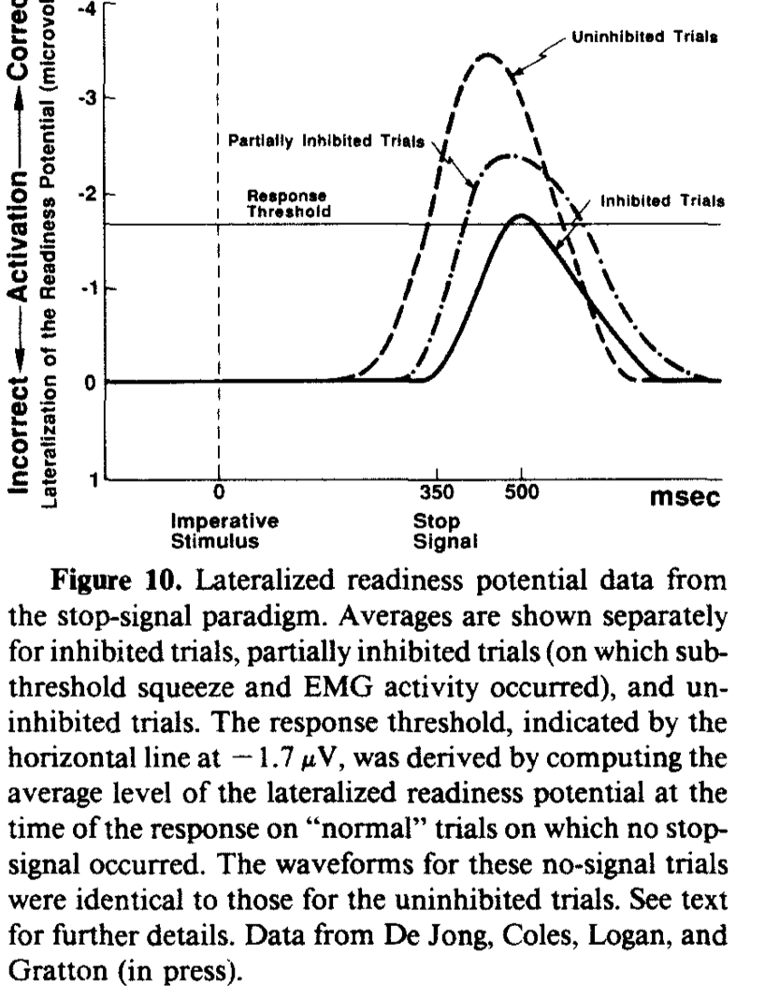

```
title: lateralized readiness potential LRP
summary: 
created: 2020-08-25 14:38:15
modified: 2020-08-25 14:38:15
tags: 
```

- drift diffusion model of choice and reaction time DDM, EEG and ERPs
- mental chronometry

# Idea
An event-related potentials ERPs|ERP that tracks the preparation for and execution of movement and reflects activity in motor cortices.

Prior to hand movements, a negative potential occurs at the scalp, and this potential is maximal at central sites, contralateral to the responding hand. Given our knowledge of the structure of motor cortices, these findings suggest that they are related to motor action.

Regardless of response latency, the amplitude of the LRP is approximately the same at. the time of response initiation (measured with EMG). Thus, when the LRP reaches a threshold, overt responses are initiated. 

This potential sheds light on how the brain prepares the motor system to act, highlights the presence of partial information transmission in the cognitive system, and provides insights on how the cognitive system inhibits responses.

The LRP might be generated by the precentral motor cortex.

From Coles 1989 modern mind brain reading - lateralized readiness potential




## LRP tracks evidence accumulation processes?

The LRP appears to track evidence accumulation in diffusion process and drift diffusion model of choice and reaction time DDM. Can we measure the LRP and show that it varies trial-by-trial with drift rate? 

From Coles 1989 modern mind brain reading - lateralized readiness potential


The LRP reveals biases in decision making (maybe also the bias parameter in DDMs?).  

From Coles 1989 modern mind brain reading - lateralized readiness potential


## LRP tracks activation of incompatible/conflicting responses
There is a dip in the lateralization function on incompatible flanker task trials (but not such dip for compatible trials). 

From Coles 1989 modern mind brain reading - lateralized readiness potential


## LRP tracks response inhibition and point of no return

From Coles 1989 modern mind brain reading - lateralized readiness potential


# References
- Kornhuber 1965: first discovered the LRP