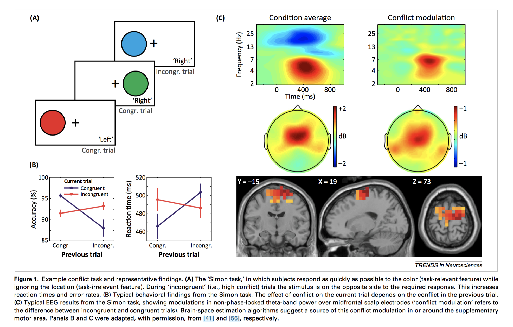
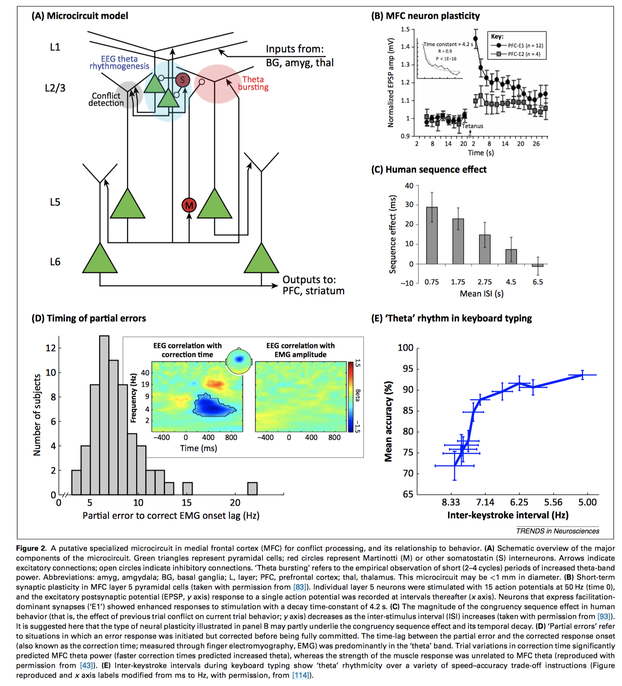

```
citation: Cohen, M. X. (2014). A neural microcircuit for cognitive conflict detection and signaling. Trends in Neurosciences, 37(9), 480-490. https://doi.org/10.1016/j.tins.2014.06.004
summary: 
created: 2020-08-26 12:09:14
modified: 2020-08-26 12:09:14
tags: 
```


- theta oscillations 3-8 Hz, anterior cingulate cortex ACC, theta oscillations 3-8 Hz, medial prefrontal cortex mPFC, conflict monitoring neural processes
- neural microcircuits
- Mike X Cohen

# Idea
How do medial prefrontal cortex mPFC theta oscillations 3-8 Hz detect conflict and signal it? Mike X Cohen proposed a neural microcircuits model that processes conflict and generates theta oscillations 3-8 Hz. Cognitive neuroscience models need biological constraints and have to move beyond box-and-arrow models.

Two main findings: 
1. a brief, non-phase-locked increase in midfrontal theta correlates with conflict and manifestations of conflict (RTs)
2. task-relevant brain regions become phase-locked to ongoing midfrontal theta oscillations



## Layers and microcircuits in mFPC
mPFC regions implicated in conflict processing have relatively low cell density and few parvalbumin-positive interneurons and contain no layer 4, which is the primary thalamic input layer. Hence, it's unlikely that the thalamus plays a significant role in generating theta oscillations 3-8 Hz. 

Cohen proposed neural microcircuits produce brain oscillations. MFC cells tend to bundle together vertically within microcircuits, and are more likely to be connected within circuits than across circuits.

### Layer 5: conflict detection
Large cortical pyramidal cells with apical dendrites that terminate in superficial layers. They are densely connected with other layer 5 pyramidal cells within and across columns. Hyperconnectivity with other pyramidal cells will quickly trigger an avalanche of synchronous theta spiking in a larger population. However, there are also inhibitory connections that can shut down theta after a few cycles (hence we tend to observe transient instead of prolonged theta activity). They switch from slow-bursting to regular theta-spiking when driven by input currents. Conflict detection is implemented via coincidence detection.

 > p485. When no conflict has been detected for many seconds (e.g., after a congruent trial in the Simon task), the neurons are less excitable and thus require stronger input over a longer period of time to be able to detect and signal coincidence (conflict). This would result in increased theta activity and slower reaction times. By contrast, after a recent conflict is detected, the layer 5 neurons are more excitable, and thus can detect coincidences faster and with less input, leading to overall less theta activity and faster reaction times.

### Layer 4: no layer 4!

### Layer 2/3: input integration and theta oscillations
Layer 5 spiking cannot be captured by EEG, so EEG conflict activity must reflect also integration activity in layers 2 and 3, which contain cortical pyramidal cells that are smaller than those in deeper layers. They have branching apical dendrites suited to integrate, filter, and amplify incoming information. They can also oscillate independently of deeper layers, but can strongly entrain layer 5 spiking.

> p486. Thus, careful consideration of the neuroscientific evidence leads to the novel and perhaps surprising claim that the theta oscillations recorded by EEG do not reflect conflict processing per se, but instead reflect the input integration process that leads to the detection of conflict.

### Layer 6: long-range conflict signaling 
Layer 6 contains output cortical pyramidal cells with long-range projections to the superficial layers of distant cortical regions, such as dorsolateral prefrontal cortex dlPFC and subcortical regions such as striatum, ventral tegmental area VTA. Spiking in layer 5 activates layer 6, causing theta phase-locking between MFC and other networks, particularly when the long-range efferents synapse onto inhibitory interneurons.



# References
- Ward 2003 synchronous neural oscillations and cognitive processes
- Cavanagh 2014 frontal theta as a mechanism for cognitive control