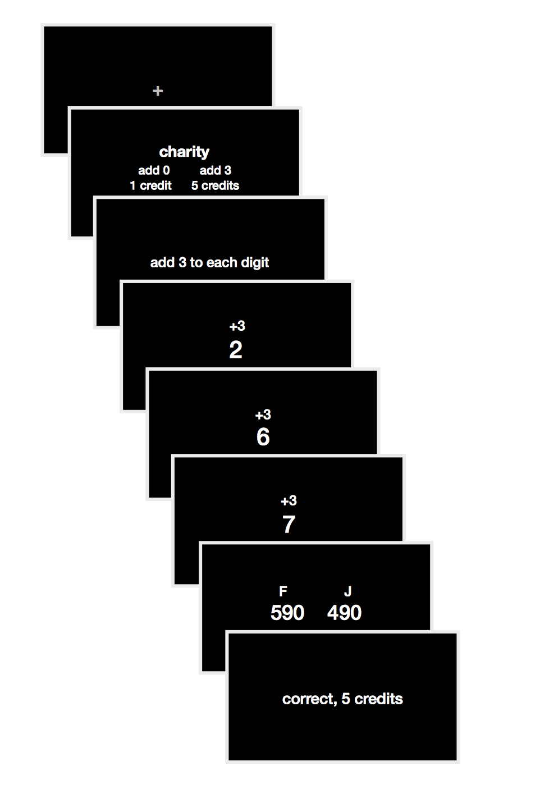
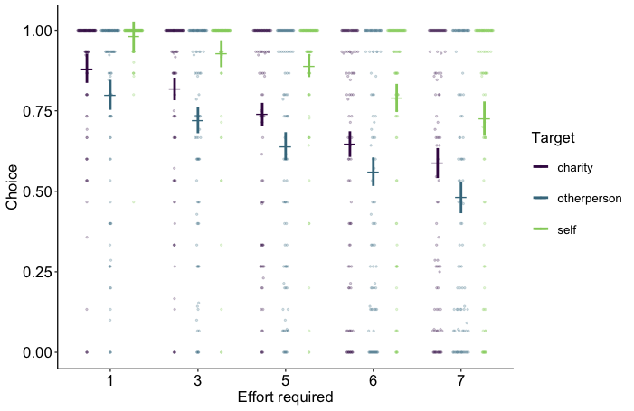
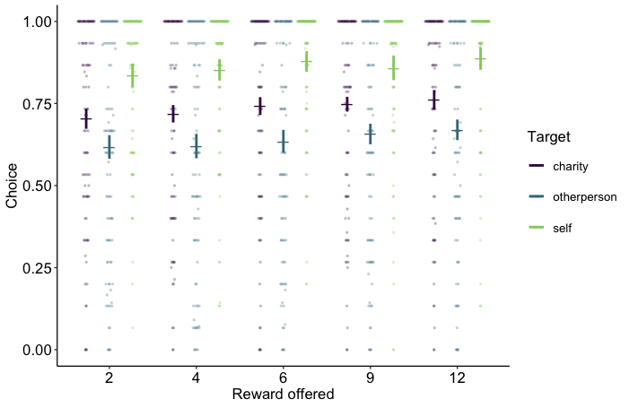
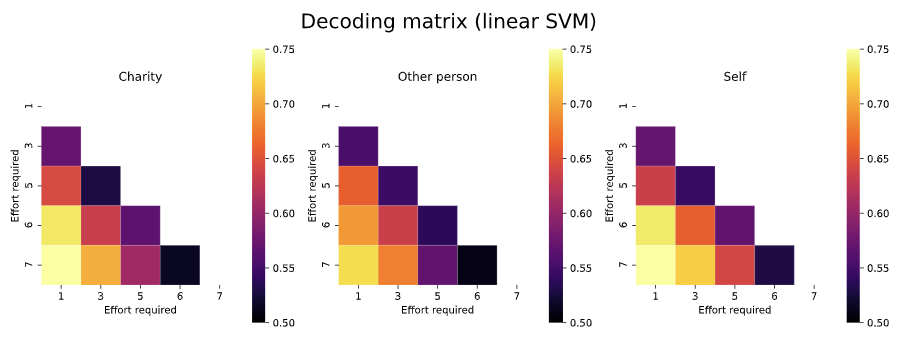
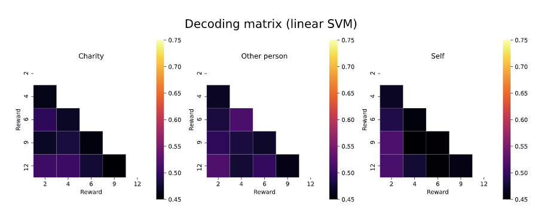
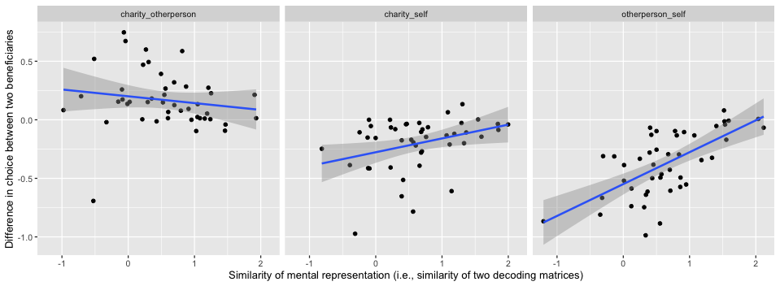
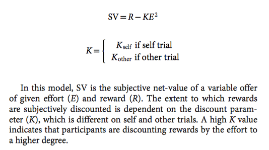

```
title: 20201002_105135 lab meeting - why do people help
summary: self-relevance?
created: 2020-10-02 10:51:46
modified: 2020-10-02 10:51:46
tags: 
```

# Questions (for you guys)
- Anything wrong/weird with the analyses?
- What follow-up or control analyses?
- How to frame the results/findings?

# Study design
- Study 1: 5 reward, 5 effort, 2 targets
    - **reward**: 2, 4, 6, 8, 12, credits (converted to cash bonus)
    - **effort**: add 1, 3, 5, 7, or 9 to each digit
    - **target**: self, charity (choose from 1 of five, or self-nominated charity)
- Study 2: 5 reward, 5 effort, 3 targets
    - **reward**: 2, 4, 6, 8, 12
    - **effort**: add 1, 3, 5, 6, 7 to each digit
    - **target**: self, charity, other UTSC student

## Trial events
- interleaved trials (i.e., targets interleaved within block): 75 trial per target, thus 225 trials total (3 blocks)
- credits converted to cash bonus only if participant's overall accuracy on the task > 90%
- excluded from analyses
    - participants whose chose either the baseline option (add 0, 1 credit) or difficult option more on > 85% trials
    - participants whose overall task accuracy < 80%



### Outcome variables
- choice: baseline or difficult option
- choice RT
- task RT: RT on the addition task
- task accuracy

# Behavioral results



# Decoding results
## Decode effort levels

```py
def fit_classifier(X, y, loss="hinge", penalty="l2", cv=5, alpha=0.3):
    model = SGDClassifier(loss=loss, penalty=penalty, alpha=alpha)
    return cross_val_score(model, X, y, cv=cv).mean()
```

Grand average decoding SVM matrix: overall decoding accuracies differed between groups



```r
> summaryh(anova(m2))
    term                     results
1: group F(2, 1306) = 3.28, p = .038

> summaryh(m2)
               term                                                    results
1:      (Intercept)     b = 0.64, SE = 0.02, t(59) = 38.52, p < .001, r = 0.98
2:     groupcharity b = −0.009, SE = 0.01, t(1307) = −0.83, p = .405, r = 0.02
3: groupotherperson  b = −0.03, SE = 0.01, t(1305) = −2.51, p = .012, r = 0.07
```

## Cannot decode reward levels


# Correlations between matrix similarity and behavior
- compute pairwise matrix correlations (Mantel's r) for each subject
- correlate Mantel's r (transformed to z) with behavior



Results
- significant interaction, p < .001
    - otherperson_self, p < .001, r = 0.65
    - charity_otherperson, p = .303, r = 0.16
    - charity_self, p = .023, r = 0.34
	
# Future analyses?
- circularity in analyses?
- control analyses?
    - remove choice as feature?
- within-subjects analysis
	- distance-to-boundary/hyperplane (e.g., residuals) as a similarity index?
- extending/updating [Lockwood et al. 2017](https://www.nature.com/articles/s41562-017-0131)'s model?

